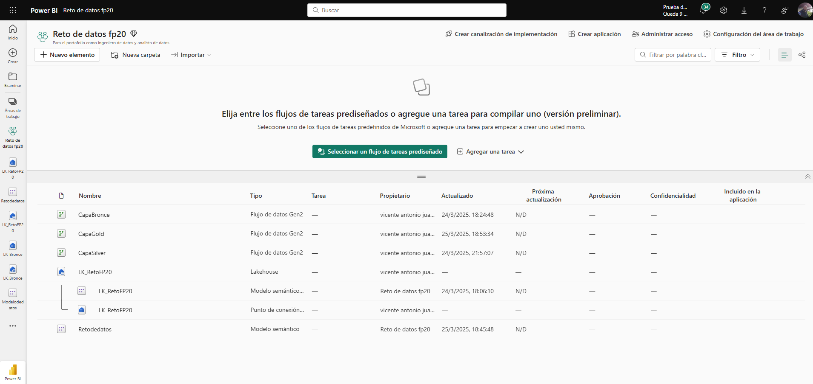
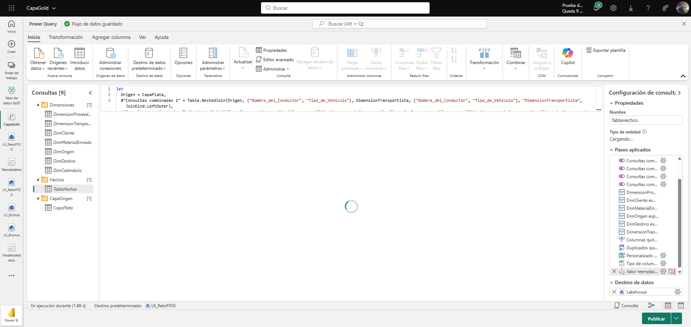
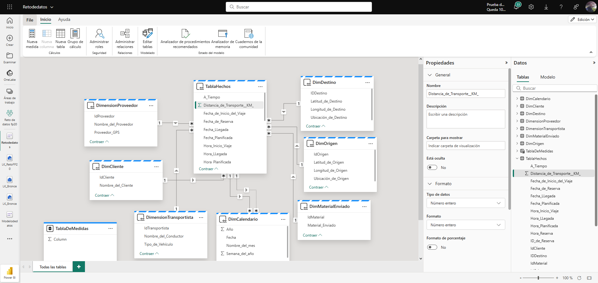
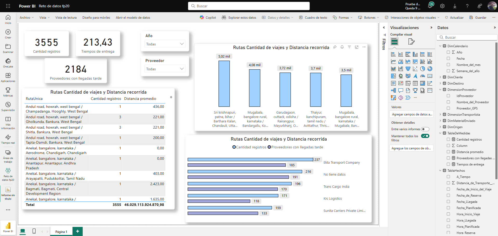
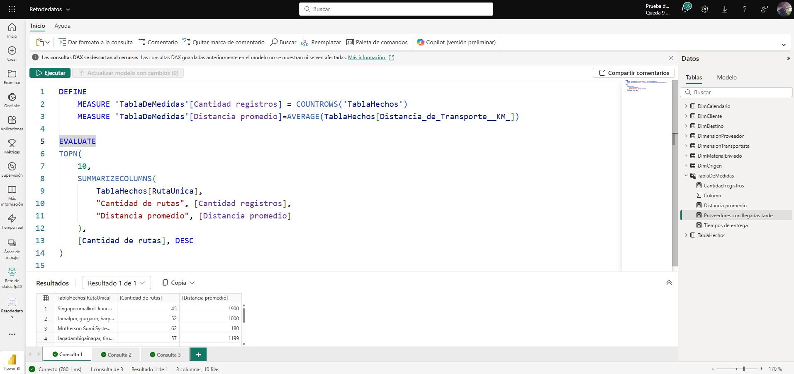

# 🚚 Proyecto de Análisis de Transporte y Logística con Microsoft Fabric y Power BI

Este proyecto fue desarrollado como parte del reto **FP20**, con el objetivo de construir un flujo de análisis de datos **end-to-end** utilizando la plataforma **Microsoft Fabric**, desde la ingesta hasta la visualización con **Power BI**, pasando por un modelo dimensional robusto.

---

## 🔧 Herramientas Utilizadas

- Microsoft Fabric (Dataflow Gen2, Lakehouse, Semantic Model)
- Power BI
- Power Query
- DAX
- Excel

---

## 🎯 Objetivo General

Analizar rutas, distancias, tiempos de entrega y proveedores con demoras, utilizando un enfoque de arquitectura moderna basada en capas **Bronce, Plata y Oro**, y generar visualizaciones que permitan tomar decisiones logísticas basadas en datos.

---

## 🧱 Arquitectura por Capas

### 🟫 Capa Bronce: Datos Crudos

En esta etapa se cargan los datos **sin transformaciones**, tal como vienen del archivo fuente. Esta capa sirve como respaldo histórico e inmutable, garantizando trazabilidad.

🔍 Se almacenan:
- Reservas de envío
- Información de rutas
- Fechas y horarios

📌 **Propósito**:
- Guardar la fuente original
- Auditar la calidad de datos futura

📸 **Imagen de artefactos creados en Fabric**  

---

### 🪙 Capa Plata: Datos Limpiados y Normalizados

Aquí se realiza la **transformación de datos**, limpiando duplicados, valores nulos y ajustando nombres de columnas. También se ajusta la estructura para facilitar el modelado.

📌 **Incluye**:
- Normalización de nombres
- Eliminación de datos inconsistentes
- Conversión de tipos
- Unión y relación de datasets

📸 **Visualización del Dataflow**  

---

### 🥇 Capa Oro: Modelo Dimensional y Métricas

Se construye el **modelo dimensional**, separando tablas de hechos y dimensiones. Esta capa está optimizada para la consulta y análisis en Power BI.

📌 **Se modelan**:
- Hechos de transporte (distancia, tiempos)
- Dimensiones: Proveedor, Cliente, Transporte, Origen, Destino, Material, Calendario

📸 **Modelo Semántico Relacional**  

---

## 📊 Visualización de Datos

En Power BI se construyó un panel interactivo con indicadores clave como:

- Total de registros
- Proveedores con más entregas tardías
- Distancia total recorrida
- Rutas frecuentes

📸 **Dashboard Power BI**  

---

## 🧠 Medidas DAX

Se utilizaron fórmulas DAX para calcular tiempos de entrega, identificar proveedores con demoras y analizar distancias promedio por ruta.

📸 **Medidas DAX en Power BI**  

---

## 🔄 Flujo End-to-End

1. Carga de dataset original en Lakehouse (Capa Bronce)
2. Transformaciones en Dataflow Gen2 (Capa Plata)
3. Modelado dimensional (Capa Oro)
4. Publicación del modelo semántico
5. Diseño de dashboard en Power BI

---

## 📌 Conclusiones

- El modelo permitió identificar rutas críticas y proveedores con mayor incidencia en retrasos.
- Se aprovechó todo el ecosistema de Microsoft Fabric de manera integrada.
- La arquitectura en capas garantiza escalabilidad y gobernanza de datos.

---

## 👤 Autor

**Vicente Antonio Juan Magallanes**  
[🔗 LinkedIn](www.linkedin.com/in/vicente-antonio-juan-magallanes-ba7ab4127) | [📧 Email](vicenteajm@hotmail.com) | [🎓 Certificación Microsoft](https://learn.microsoft.com/es-es/users/vicentejuanmagallanes-2480/credentials/5c1cf13ae14b5a65?ref=https%3A%2F%2Fwww.linkedin.com%2F)

---

> ⭐ Si este proyecto te pareció interesante, ¡agrégale una estrella y sígueme para más contenido de análisis de datos con Power BI y Microsoft Fabric!
